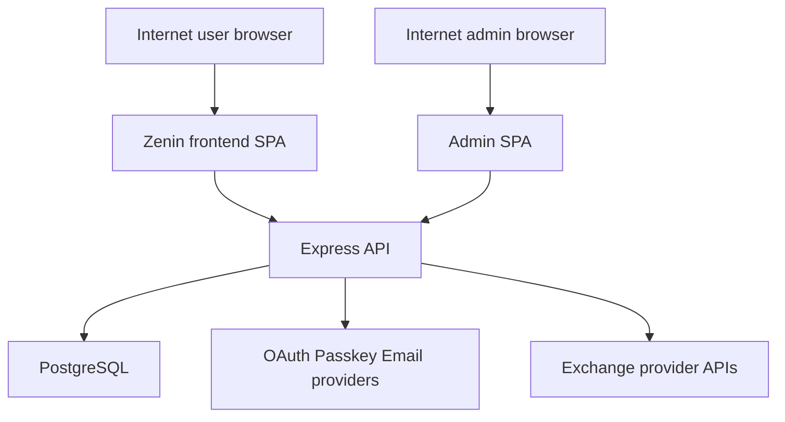

# Zenin Threat Model

## Executive summary
Zenin’s highest-risk areas are the boundaries that combine internet exposure with strong privileges or high-sensitivity data: the internet-facing admin API and admin SPA, the new multi-tenant `Desk` workspace model that scopes shared portfolios/watchlists/trades/cash by `workspace_id`, and the backend storage and use of trading-capable exchange credentials. The strongest failure modes in this repo are cross-workspace authorization mistakes, admin-account compromise or misuse, and exfiltration or abuse of exchange API secrets; these sit above generic web-app issues because the repo now explicitly supports shared customer organizations, privileged admin actions, and server-side handling of trading-capable credentials. Evidence anchors: [backend/index.js](/Users/jeremiahkamama/Desktop/zenin/zenin/backend/index.js) symbols `requireWorkspaceMember`, `requireWorkspaceAdmin`, `requireAdmin`, `/api/admin/*`, `/api/db/exchange-keys`, `/api/db/exchange-sync/:id`; [backend/database.js](/Users/jeremiahkamama/Desktop/zenin/zenin/backend/database.js) symbols `workspaces`, `workspace_members`, `workspace_invites`, `user_exchange_keys`, `ensurePersonalWorkspace`.

## Scope and assumptions
- In scope:
  - [backend/index.js](/Users/jeremiahkamama/Desktop/zenin/zenin/backend/index.js)
  - [backend/database.js](/Users/jeremiahkamama/Desktop/zenin/zenin/backend/database.js)
  - [backend/validation.js](/Users/jeremiahkamama/Desktop/zenin/zenin/backend/validation.js)
  - [backend/email.js](/Users/jeremiahkamama/Desktop/zenin/zenin/backend/email.js)
  - [frontend/src/utils/zeninFetch.js](/Users/jeremiahkamama/Desktop/zenin/zenin/frontend/src/utils/zeninFetch.js)
  - [frontend/src/AuthPage.jsx](/Users/jeremiahkamama/Desktop/zenin/zenin/frontend/src/AuthPage.jsx)
  - [frontend/src/constants/apiConfig.js](/Users/jeremiahkamama/Desktop/zenin/zenin/frontend/src/constants/apiConfig.js)
  - [admin/src/App.jsx](/Users/jeremiahkamama/Desktop/zenin/zenin/admin/src/App.jsx)
- Out of scope:
  - visual design quality, non-security UX issues, and generated frontend bundles
  - deep review of third-party services beyond how the repo integrates with them
  - CI/CD pipeline details not evidenced in the reviewed runtime paths
- Confirmed assumptions from the user:
  - the admin dashboard is internet-accessible in production
  - Zenin can hold trading-capable exchange credentials in production
  - `Desk` is a true shared multi-tenant environment across customer organizations
- Additional assumptions used for ranking:
  - the Express backend is the main trust anchor for authn/authz and data scoping
  - cookies are the primary browser auth mechanism, with frontend `localStorage` used only as convenience state rather than authoritative auth
  - compromise of a workspace can expose financial data and potentially lead to unauthorized sync or trading actions, depending on connected exchange capabilities
- Open questions that would materially change the ranking:
  - whether production admin access is additionally restricted by VPN, IP allowlisting, or IdP policy outside this repo
  - whether exchange credentials are always restricted to read-only or whether order/trade scopes are actively supported for all venues
  - whether database backups, logs, and secret-management systems encrypt or further isolate `user_exchange_keys` outside app-layer encryption

## System model
### Primary components
- Browser frontend for end users in [frontend/src/AuthPage.jsx](/Users/jeremiahkamama/Desktop/zenin/zenin/frontend/src/AuthPage.jsx) and fetch wrapper [frontend/src/utils/zeninFetch.js](/Users/jeremiahkamama/Desktop/zenin/zenin/frontend/src/utils/zeninFetch.js). It stores convenience state like `zenin_auth_user` in `localStorage` and sends cookie-authenticated API calls with `credentials: "include"`.
- Internet-facing Express API in [backend/index.js](/Users/jeremiahkamama/Desktop/zenin/zenin/backend/index.js). It owns sessions, auth flows, OAuth, passkeys, MFA, workspace resolution, trading data APIs, exchange-key APIs, and admin routes.
- PostgreSQL persistence layer in [backend/database.js](/Users/jeremiahkamama/Desktop/zenin/zenin/backend/database.js) for `app_users`, workspace membership, workspace-scoped cash/portfolio/watchlist/trades/fills, workspace docs/collections, alerts, and `user_exchange_keys`.
- Internet-facing admin SPA in [admin/src/App.jsx](/Users/jeremiahkamama/Desktop/zenin/zenin/admin/src/App.jsx), backed by privileged `/api/admin/*` routes in [backend/index.js](/Users/jeremiahkamama/Desktop/zenin/zenin/backend/index.js).
- External identity and messaging integrations: OAuth providers, passkeys/WebAuthn, and email delivery via [backend/email.js](/Users/jeremiahkamama/Desktop/zenin/zenin/backend/email.js).
- External exchange/provider APIs reached through workspace exchange sync paths in [backend/index.js](/Users/jeremiahkamama/Desktop/zenin/zenin/backend/index.js) symbol `/api/db/exchange-sync/:id`.

### Data flows and trust boundaries
- Internet user browser -> Frontend SPA -> Backend API
  - Data types: credentials, session cookies, signup/signin payloads, password reset tokens, passkey material, workspace actions, portfolio/watchlist/trade inputs
  - Channel: HTTPS/HTTP JSON over browser fetch
  - Security guarantees: cookie `httpOnly`, `secure` by request/env, `sameSite` `lax` or `none`; auth/session checks via `requireSignedIn`; CSRF-style trusted-origin enforcement for state-changing requests; route-level rate limiting via `authLimiter`, `writeLimiter`, `expensiveReadLimiter`
  - Validation: schema validation middleware on many mutating routes, plus route-level auth and plan checks
  - Evidence anchors: [backend/index.js](/Users/jeremiahkamama/Desktop/zenin/zenin/backend/index.js) symbols `SESSION_COOKIE_NAME`, `buildSessionCookieOptions`, trusted origin middleware, `requireSignedIn`, `validate(...)`; [frontend/src/utils/zeninFetch.js](/Users/jeremiahkamama/Desktop/zenin/zenin/frontend/src/utils/zeninFetch.js) symbol `zeninFetch`
- Backend API -> PostgreSQL
  - Data types: user records, sessions, MFA state, workspace membership, workspace activity, portfolio/watchlist/trade/cash data, encrypted exchange credentials
  - Channel: server-side SQL queries
  - Security guarantees: app-layer authz before DB access; `workspace_id` scoping for shared data; app-layer encryption for exchange credentials and TOTP secrets derived from `AUTH_HASH_KEY`
  - Validation: SQL predicates on `workspace_id`, `user_id`, and route-derived active workspace; migration/backfill logic enforces workspace ownership model
  - Evidence anchors: [backend/database.js](/Users/jeremiahkamama/Desktop/zenin/zenin/backend/database.js) symbols `active_workspace_id`, `workspaces`, `workspace_members`, `user_exchange_keys`, `ensurePersonalWorkspace`; [backend/index.js](/Users/jeremiahkamama/Desktop/zenin/zenin/backend/index.js) symbols `attachActiveWorkspace`, `requireWorkspaceMember`
- Backend API -> OAuth/email/passkey providers
  - Data types: OAuth state, email verification codes, password reset tokens, WebAuthn ceremonies
  - Channel: HTTP redirects/callbacks and provider APIs
  - Security guarantees: HMAC-signed OAuth state with `AUTH_HASH_KEY`, hashed verification/reset tokens, MFA secret encryption
  - Validation: callback state verification, auth route rate limits, provider-specific verification
  - Evidence anchors: [backend/index.js](/Users/jeremiahkamama/Desktop/zenin/zenin/backend/index.js) symbols `hashToken`, OAuth state signing/verification, passkey routes, password reset routes; [backend/email.js](/Users/jeremiahkamama/Desktop/zenin/zenin/backend/email.js)
- Backend API -> Exchange/provider APIs
  - Data types: decrypted workspace API keys/secrets, sync metadata, account refresh requests
  - Channel: server-side outbound API calls
  - Security guarantees: access to sync routes requires signed-in workspace member and `pro` plan; secrets are encrypted at rest and decrypted only in sync flow
  - Validation: route authz and workspace ownership checks before decrypt/use
  - Evidence anchors: [backend/index.js](/Users/jeremiahkamama/Desktop/zenin/zenin/backend/index.js) symbols `/api/db/exchange-keys`, `/api/db/exchange-sync/:id`, `encryptWorkspaceData`, `decryptWorkspaceData`
- Internet admin browser -> Admin SPA -> Admin API
  - Data types: user management commands, plan changes, session revocations, recovery actions, alerts/incidents, billing/integration metadata
  - Channel: HTTPS/HTTP JSON over browser fetch
  - Security guarantees: `requireAdmin`, admin rate limiting, normal signed-in session dependency
  - Validation: route authz and some request validation, but broad privilege concentration remains
  - Evidence anchors: [backend/index.js](/Users/jeremiahkamama/Desktop/zenin/zenin/backend/index.js) symbols `requireAdmin`, `adminRateLimit`, `/api/admin/*`; [admin/src/App.jsx](/Users/jeremiahkamama/Desktop/zenin/zenin/admin/src/App.jsx)

#### Diagram

## Assets and security objectives
| Asset | Why it matters | Security objective (C/I/A) |
|---|---|---|
| Session cookies and auth tokens | Session theft or misuse yields account takeover and access to workspace data and actions. Evidence: [backend/index.js](/Users/jeremiahkamama/Desktop/zenin/zenin/backend/index.js) `SESSION_COOKIE_NAME`, `hashToken`. | C/I |
| Workspace membership and active workspace binding | Authorization relies on correct `workspace_id` and membership state; mistakes create cross-tenant data exposure or privilege escalation. Evidence: [backend/database.js](/Users/jeremiahkamama/Desktop/zenin/zenin/backend/database.js) `active_workspace_id`, `workspace_members`, `ensurePersonalWorkspace`. | C/I |
| Exchange API keys and secrets | They may enable account surveillance or actual trading if stolen or abused. Evidence: [backend/index.js](/Users/jeremiahkamama/Desktop/zenin/zenin/backend/index.js) `encryptWorkspaceData`, `/api/db/exchange-sync/:id`; [backend/database.js](/Users/jeremiahkamama/Desktop/zenin/zenin/backend/database.js) `user_exchange_keys`. | C/I |
| Portfolio, watchlist, trade, and cash records | These drive user-visible positions, PnL, and operational decisions; corruption or cross-workspace leakage is high-harm. Evidence: [backend/database.js](/Users/jeremiahkamama/Desktop/zenin/zenin/backend/database.js) `user_workspace_portfolio`, `user_workspace_watchlist`, `user_workspace_trades`, `user_workspace_cash`. | C/I |
| Admin privileges and admin actions | Admin routes can recover users, change roles/plans, revoke sessions, suspend/delete accounts, and inspect billing/logs. Evidence: [backend/index.js](/Users/jeremiahkamama/Desktop/zenin/zenin/backend/index.js) `/api/admin/users/:id/recover`, `/api/admin/users/:id/role`, `/api/admin/sessions/revoke-all`. | C/I/A |
| MFA secrets, verification codes, reset tokens | These protect or recover access; compromise weakens account security and takeover resistance. Evidence: [backend/index.js](/Users/jeremiahkamama/Desktop/zenin/zenin/backend/index.js) `TOTP_ENC_KEY`, password reset flows. | C/I |
| Workspace activity and alert-assignment logs | They support accountability and detection; tampering can hide abuse. Evidence: [backend/database.js](/Users/jeremiahkamama/Desktop/zenin/zenin/backend/database.js) `workspace_activity_log`, `workspace_alert_assignments`. | I/A |
| API and sync availability | Rate-limit bypass or expensive operation abuse can degrade desk operations and analytics for multiple tenants. Evidence: [backend/index.js](/Users/jeremiahkamama/Desktop/zenin/zenin/backend/index.js) `writeLimiter`, `expensiveReadLimiter`, exchange sync routes. | A |

## Attacker model
### Capabilities
- Remote internet attacker with no account can reach public auth, OAuth, password-reset, and any unintentionally exposed unauthenticated endpoints because Zenin and the admin dashboard are internet-accessible.
- Low-privilege signed-in user can create, mutate, and probe workspace-scoped data via `/api/db/*` and `/api/workspaces/current/*`, and can attempt cross-workspace access by tampering identifiers or abusing membership transitions.
- Compromised member or admin browser session can exercise high-value state changes because the app uses cookie-based browser auth and privileged routes are reachable over the internet.
- External attacker can perform phishing, credential stuffing, OAuth abuse attempts, CSRF-style origin manipulation, and targeted availability attacks against expensive/sync endpoints.

### Non-capabilities
- The attacker is not assumed to have arbitrary code execution on the backend host, direct database shell access, or control of production secret stores unless a separate exploit provides it.
- The attacker is not assumed to bypass TLS or compromise third-party identity providers directly.
- The attacker is not assumed to control CI/CD or deployment systems because those were not evidenced in the reviewed runtime scope.

## Entry points and attack surfaces
| Surface | How reached | Trust boundary | Notes | Evidence (repo path / symbol) |
|---|---|---|---|---|
| Auth endpoints | Public browser requests to signin/signup/reset/OAuth | Internet -> API | Primary pre-auth boundary; rate-limited but internet-exposed | [backend/index.js](/Users/jeremiahkamama/Desktop/zenin/zenin/backend/index.js) `/api/auth/*`, `authLimiter`; [frontend/src/AuthPage.jsx](/Users/jeremiahkamama/Desktop/zenin/zenin/frontend/src/AuthPage.jsx) |
| Passkey and MFA flows | Browser WebAuthn/MFA setup and verify | Internet -> API -> identity state | Sensitive ceremony handling and recovery logic | [backend/index.js](/Users/jeremiahkamama/Desktop/zenin/zenin/backend/index.js) passkey routes, MFA routes |
| Workspace management endpoints | Signed-in calls to current workspace, invites, role changes, removal | User workspace -> API -> DB | Core multi-tenant authz boundary | [backend/index.js](/Users/jeremiahkamama/Desktop/zenin/zenin/backend/index.js) `/api/workspaces/current*`, `requireWorkspaceAdmin` |
| Trading dataset endpoints | Signed-in calls for cash, portfolio, trades, watchlist, execute-trade | User workspace -> API -> DB | Integrity-critical workspace-scoped data plane | [backend/index.js](/Users/jeremiahkamama/Desktop/zenin/zenin/backend/index.js) `/api/db/cash`, `/api/db/portfolio`, `/api/db/trades`, `/api/db/watchlist`, `/api/db/execute-trade` |
| Exchange-key and sync endpoints | Signed-in member with plan access | User workspace -> API -> secret use -> provider API | High-sensitivity secret boundary; decrypted on use | [backend/index.js](/Users/jeremiahkamama/Desktop/zenin/zenin/backend/index.js) `/api/db/exchange-keys`, `/api/db/exchange-sync/:id` |
| Admin API | Internet-facing admin SPA and requests | Internet admin -> API -> all tenants | Broad privileged surface; compromise is platform-wide | [backend/index.js](/Users/jeremiahkamama/Desktop/zenin/zenin/backend/index.js) `/api/admin/*`, `requireAdmin`; [admin/src/App.jsx](/Users/jeremiahkamama/Desktop/zenin/zenin/admin/src/App.jsx) |
| Bootstrap endpoint | Signed-in app init | Browser -> API -> DB | Aggregates user/workspace state; useful for data-leak blast radius | [backend/index.js](/Users/jeremiahkamama/Desktop/zenin/zenin/backend/index.js) `/api/app/bootstrap` |
| Email reset/verification links | User clicks emailed links | Email channel -> frontend/backend | Token lifecycle and phishing/replay risk | [backend/email.js](/Users/jeremiahkamama/Desktop/zenin/zenin/backend/email.js); [backend/index.js](/Users/jeremiahkamama/Desktop/zenin/zenin/backend/index.js) reset/verification routes |
| OAuth mock and admin bypass toggles | Env-controlled runtime behavior | Operator config -> API | Safe in dev, catastrophic if enabled in production by mistake | [backend/index.js](/Users/jeremiahkamama/Desktop/zenin/zenin/backend/index.js) `ALLOW_OAUTH_MOCK`, `ZENIN_ADMIN_BYPASS` |

## Top abuse paths
1. Cross-tenant workspace breakout:
   1. Attacker signs into a low-privilege account.
   2. They probe workspace-scoped endpoints with tampered identifiers or membership transitions.
   3. A missing `workspace_id` predicate or flawed active-workspace mutation exposes another customer’s holdings, watchlist, docs, or alerts.
   4. Impact: cross-tenant confidentiality and integrity failure.
2. Admin session compromise:
   1. Attacker phishes or steals an admin session cookie.
   2. They use the internet-facing admin SPA/API to change user roles/plans, recover accounts, revoke sessions, or inspect tenant data.
   3. Impact: platform-wide takeover or mass tenant disruption.
3. Exchange-key exfiltration and provider abuse:
   1. Attacker gains backend read access through an app bug, admin compromise, or log/DB exposure.
   2. They obtain encrypted exchange keys and the app secret material needed to decrypt them, or they invoke sync/trading flows server-side.
   3. Impact: unauthorized provider access, surveillance, or trading actions.
4. Session/auth abuse through cross-origin or token handling weakness:
   1. Attacker abuses a gap in origin validation, cookie scoping, or reset/OAuth flow integrity.
   2. They bind a victim session to attacker-controlled state or complete takeover via reset or OAuth.
   3. Impact: account takeover and workspace compromise.
5. Invite/role workflow abuse:
   1. Attacker abuses invite acceptance or member-role transitions.
   2. A logic flaw promotes them beyond intended membership or leaves stale admin rights.
   3. Impact: persistent unauthorized access to a shared desk.
6. Sync and expensive-read DoS:
   1. Attacker automates repeated expensive reads or exchange sync triggers from multiple accounts or IPs.
   2. The app spends capacity on data fetches and writes for low-value requests.
   3. Impact: degraded desk operations and delayed analytics/sync for legitimate tenants.
7. Audit-log suppression by privileged actor:
   1. Attacker gains admin or workspace-admin privileges.
   2. They perform sensitive changes while exploiting gaps in logging coverage or integrity.
   3. Impact: slower detection and harder incident reconstruction.

## Threat model table
| Threat ID | Threat source | Prerequisites | Threat action | Impact | Impacted assets | Existing controls (evidence) | Gaps | Recommended mitigations | Detection ideas | Likelihood | Impact severity | Priority |
|---|---|---|---|---|---|---|---|---|---|---|---|---|
| TM-001 | Authenticated low-privilege tenant user | Attacker has any signed-in account and can call workspace or trading endpoints. Multi-tenant `Desk` data is shared by `workspace_id`. | Attempt cross-workspace reads or writes by abusing active workspace resolution, missing `workspace_id` predicates, invite acceptance, or role transitions. | Cross-tenant data disclosure or corruption across holdings, watchlists, docs, trades, alerts, and shared workspace state. | Workspace membership, portfolio/watchlist/trades/cash, docs/collections, alerts | Workspace-scoped routes use `attachActiveWorkspace`, `requireWorkspaceMember`, `requireWorkspaceAdmin`; DB schema adds `workspace_id` across shared tables. Evidence: [backend/index.js](/Users/jeremiahkamama/Desktop/zenin/zenin/backend/index.js) `attachActiveWorkspace`, `/api/workspaces/current*`, `/api/db/*`; [backend/database.js](/Users/jeremiahkamama/Desktop/zenin/zenin/backend/database.js) `workspace_id`, `ensurePersonalWorkspace`. | This is a new and complex migration surface; recent live bugs already affected workspace ownership and cash seeding. Authz relies on application correctness across many endpoints rather than DB-native tenant isolation. | Add integration tests for every workspace-scoped route with cross-tenant negative cases; centralize workspace resolution invariants; consider DB row-level security or service-layer repository wrappers that require `workspace_id`; add explicit ownership assertions on bootstrap and invite acceptance flows. | Alert on repeated 403s across many workspace-sensitive routes, membership/role churn spikes, and anomalous active-workspace changes. Log tenant ID on every sensitive read/write. | High | High | critical |
| TM-002 | External attacker or malicious insider targeting admins | Admin dashboard is internet-accessible and uses the same general browser/session model. | Compromise an admin account or session, then use `/api/admin/*` to recover users, change roles/plans, revoke sessions, suspend accounts, or inspect broad data. | Platform-wide tenant compromise and large-scale operational disruption. | Admin privileges, user accounts, billing state, sessions, tenant data | `requireAdmin`, `adminRateLimit`, normal signed-in session checks. Evidence: [backend/index.js](/Users/jeremiahkamama/Desktop/zenin/zenin/backend/index.js) `requireAdmin`, `/api/admin/*`; [admin/src/App.jsx](/Users/jeremiahkamama/Desktop/zenin/zenin/admin/src/App.jsx). | Internet exposure plus broad privilege concentration makes the admin plane a single high-value target. The repo evidence does not show stronger admin-only step-up auth, network restriction, or hardware-backed admin controls. | Require admin-only MFA or passkeys, separate admin IdP policy, IP allowlisting/VPN where possible, re-auth for the most destructive admin actions, and explicit audit approval for account recovery/role changes. | Alert on admin logins from new IPs/devices, bulk admin actions, recover/suspend/delete bursts, and session-revocation spikes. | Medium | High | high |
| TM-003 | External attacker exploiting app bug or privileged compromise | Attacker can read backend state, trigger sync flows, or leverage admin compromise. Exchange keys may be trading-capable. | Steal encrypted exchange credentials and decrypt them via secret compromise or invoke server-side sync/trading operations against provider APIs. | Unauthorized market/account access, potential trading activity, and sensitive financial exposure. | Exchange API keys/secrets, linked exchange accounts, workspace integrity | Exchange keys are encrypted with AES-GCM derived from `AUTH_HASH_KEY`; access requires signed-in workspace member and plan checks. Evidence: [backend/index.js](/Users/jeremiahkamama/Desktop/zenin/zenin/backend/index.js) `WORKSPACE_ENC_KEY`, `encryptWorkspaceData`, `/api/db/exchange-keys`, `/api/db/exchange-sync/:id`; [backend/database.js](/Users/jeremiahkamama/Desktop/zenin/zenin/backend/database.js) `user_exchange_keys`. | Encryption is app-local and derived from a broad app secret, so backend compromise can collapse both ciphertext and key usage. Repo evidence does not show HSM/KMS isolation, per-tenant keys, or read-only scope enforcement. | Move exchange-key encryption to KMS/HSM-backed envelope encryption, store provider scope metadata and enforce read-only where possible, gate sync/trade-capable actions behind stronger re-auth and audit, and segregate sync workers from general API hosts. | Alert on unusual sync frequency, first-time venue use, decryption failures, provider error bursts, and admin or member actions touching exchange credentials. | Medium | High | high |
| TM-004 | Remote attacker targeting auth/session flows | Attacker can send browser requests, lure victims to malicious origins, or abuse reset/OAuth flows. | Abuse a weakness in origin checks, cookie configuration, OAuth state handling, or token lifecycle to hijack accounts or sessions. | Account takeover leading to workspace compromise. | Sessions, auth state, MFA/reset flows | HMAC-signed OAuth state, hashed tokens, `httpOnly` cookies, trusted-origin enforcement for state-changing requests, auth rate limits. Evidence: [backend/index.js](/Users/jeremiahkamama/Desktop/zenin/zenin/backend/index.js) `hashToken`, OAuth state signing, `buildSessionCookieOptions`, origin middleware, `authLimiter`. | Cookie behavior varies between `lax` and `none`; browser-side convenience auth state lives in `localStorage`; correctness depends on comprehensive origin enforcement across all mutating routes. | Add explicit CSRF tokens for cookie-auth state changes, tighten allowed origins, keep OAuth and reset callback paths minimal, and review every mutation for origin-check coverage. Avoid trusting `localStorage` user state for any privileged UI decisions. | Alert on reset/OAuth failure spikes, new-session bursts after reset, and repeated origin-check denials. | Medium | High | high |
| TM-005 | Malicious or compromised workspace member | Attacker has member access to a Desk workspace or obtains an invite token. | Abuse invite acceptance, stale membership state, or role change flaws to gain or retain admin-level workspace access. | Unauthorized workspace administration and persistence inside a customer tenant. | Workspace membership, admin rights, shared datasets | Admin-only role change and invite endpoints, member tables with status/role, activity logging. Evidence: [backend/index.js](/Users/jeremiahkamama/Desktop/zenin/zenin/backend/index.js) `/api/workspaces/current/invites`, `/members/:userId/role`; [backend/database.js](/Users/jeremiahkamama/Desktop/zenin/zenin/backend/database.js) `workspace_members`, `workspace_invites`, `workspace_activity_log`. | Recent bugs already affected ownership logic in `ensurePersonalWorkspace`, showing this area is regression-prone. Invite token security properties are not visible in the reviewed frontend. | Add regression tests for invite accept/remove/rejoin/role downgrade paths, forbid ambiguous auto-promotion in workspace bootstrap code, enforce invite expiration and one-time use, and require confirmation for owner/admin privilege changes. | Alert on invite acceptances followed quickly by admin actions, repeated role changes, and reactivated members. | Medium | Medium | medium |
| TM-006 | External attacker or abusive tenant user | Attacker can automate requests across expensive reads and sync endpoints. | Flood expensive analytics/bootstrap/sync endpoints to degrade backend and provider capacity. | Availability degradation for portfolios, analytics, and connected-account refresh across tenants. | API availability, sync availability, operational stability | General, write, auth, password-reset, and expensive-read rate limiters; admin-specific limiter. Evidence: [backend/index.js](/Users/jeremiahkamama/Desktop/zenin/zenin/backend/index.js) `generalLimiter`, `writeLimiter`, `expensiveReadLimiter`, `adminRateLimit`. | Availability controls are mostly route-level and may not reflect true downstream cost, especially for exchange syncs or large bootstrap flows. Multi-account or distributed abuse can still hurt. | Add stricter per-user and per-workspace quotas for sync and expensive reads, queue/debounce exchange sync jobs, and cache low-volatility bootstrap payloads. | Track per-route latency, queue depth, sync failures, workspace-level request spikes, and provider throttling errors. | Medium | Medium | medium |
| TM-007 | Operator misconfiguration or deployment mistake | Production deploy accidentally enables a dev-only toggle or fallback secret posture. | Enable OAuth mock or admin bypass in an unsafe environment, or run with weak secret configuration. | Immediate auth bypass or privilege escalation. | Admin privileges, auth integrity, all tenant data | Production enforces `AUTH_HASH_KEY` length and disables `ZENIN_ADMIN_BYPASS` by env check. OAuth mock is behind `ALLOW_OAUTH_MOCK`. Evidence: [backend/index.js](/Users/jeremiahkamama/Desktop/zenin/zenin/backend/index.js) `AUTH_HASH_KEY`, `ALLOW_OAUTH_MOCK`, `ZENIN_ADMIN_BYPASS`. | Misconfiguration remains catastrophic, and the repo evidence does not show startup hard-fail for all unsafe toggles in production. | Fail closed at startup if `ALLOW_OAUTH_MOCK` or similar dev toggles are enabled in production, and emit explicit startup warnings/health-check flags for dangerous config. | Alert on startup config anomalies and any hit to mock auth endpoints outside dev. | Low | High | medium |
| TM-008 | Privileged attacker hiding activity | Attacker already has admin or workspace-admin rights. | Perform sensitive actions while exploiting incomplete or mutable audit logging to reduce forensic visibility. | Slower detection and incident response, reduced trust in post-incident evidence. | Activity logs, audit integrity, response workflows | Workspace activity log exists; admin logs endpoint exists. Evidence: [backend/database.js](/Users/jeremiahkamama/Desktop/zenin/zenin/backend/database.js) `workspace_activity_log`; [backend/index.js](/Users/jeremiahkamama/Desktop/zenin/zenin/backend/index.js) `/api/admin/logs`. | Logging coverage/integrity guarantees are not fully evidenced for every privileged action, and logs appear application-managed rather than append-only. | Ensure every privileged admin and workspace-admin mutation logs actor, target, previous value, and request context; export logs to append-only external storage. | Alert on gaps between privileged mutations and audit events, and on log access/deletion anomalies. | Medium | Medium | medium |

## Criticality calibration
- `critical`
  - Any exploit that breaks cross-tenant isolation across Desk workspaces, such as unauthorized reads/writes of another tenant’s holdings or watchlist data.
  - Any bug or compromise that yields effective platform-admin control over internet-facing admin routes.
  - Any issue that enables unauthorized use or extraction of trading-capable exchange credentials at scale.
- `high`
  - Single-tenant account takeover that exposes one workspace’s full financial state.
  - Provider-sync abuse that can perform unauthorized actions for one workspace.
  - Production misconfiguration that exposes admin or auth bypass but requires a narrower precondition than active exploitation.
- `medium`
  - Availability attacks that materially degrade sync or analytics for multiple tenants but do not break integrity.
  - Membership or invite workflow flaws confined to one tenant with recoverable blast radius.
  - Audit-log integrity gaps that do not themselves grant access but materially hinder detection.
- `low`
  - Low-sensitivity information disclosure with no account or tenant boundary break.
  - Noisy abuse already strongly rate-limited with limited blast radius.
  - Dev-only issues that are clearly unreachable in production under confirmed config.

## Focus paths for security review
| Path | Why it matters | Related Threat IDs |
|---|---|---|
| [backend/index.js](/Users/jeremiahkamama/Desktop/zenin/zenin/backend/index.js) | Main trust anchor for auth, admin, workspace scoping, exchange-key handling, and all high-value endpoints. | TM-001, TM-002, TM-003, TM-004, TM-006, TM-007 |
| [backend/database.js](/Users/jeremiahkamama/Desktop/zenin/zenin/backend/database.js) | Encodes the multi-tenant workspace model, migration/backfill logic, and workspace-scoped trading data invariants. | TM-001, TM-003, TM-005, TM-008 |
| [backend/validation.js](/Users/jeremiahkamama/Desktop/zenin/zenin/backend/validation.js) | Request schema enforcement affects whether attacker-controlled input reaches sensitive state transitions safely. | TM-001, TM-004, TM-005, TM-006 |
| [admin/src/App.jsx](/Users/jeremiahkamama/Desktop/zenin/zenin/admin/src/App.jsx) | Internet-facing privileged operator surface with broad blast radius if session or flows are weak. | TM-002, TM-008 |
| [frontend/src/utils/zeninFetch.js](/Users/jeremiahkamama/Desktop/zenin/zenin/frontend/src/utils/zeninFetch.js) | Browser-side auth request behavior, credential inclusion, and plan-simulation header handling affect trust-boundary assumptions. | TM-004 |
| [frontend/src/AuthPage.jsx](/Users/jeremiahkamama/Desktop/zenin/zenin/frontend/src/AuthPage.jsx) | Frontend auth, OAuth, passkey, and recovery initiation flows shape takeover exposure and unsafe UI trust assumptions. | TM-004, TM-007 |
| [backend/email.js](/Users/jeremiahkamama/Desktop/zenin/zenin/backend/email.js) | Password reset and verification delivery are common takeover paths and phishing surfaces. | TM-004 |

## Quality check
- Covered all discovered major runtime entry points: auth, passkeys/MFA, bootstrap, workspace admin, trading datasets, exchange sync, admin APIs, and email-linked auth flows.
- Represented each major trust boundary in at least one threat: browser to API, API to DB, API to identity/email services, API to exchange providers, and admin browser to admin API.
- Kept runtime behavior separate from unreviewed CI/build/dev details; no CI-specific findings are claimed.
- Reflected the user’s clarifications: internet-facing admin, trading-capable credentials, and true multi-tenant Desk are all baked into the priority ranking.
- Left remaining assumptions explicit, especially around production admin network controls and secret isolation outside the app process.
